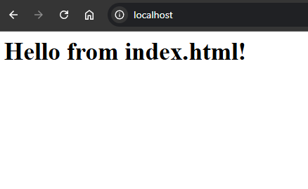
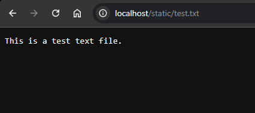
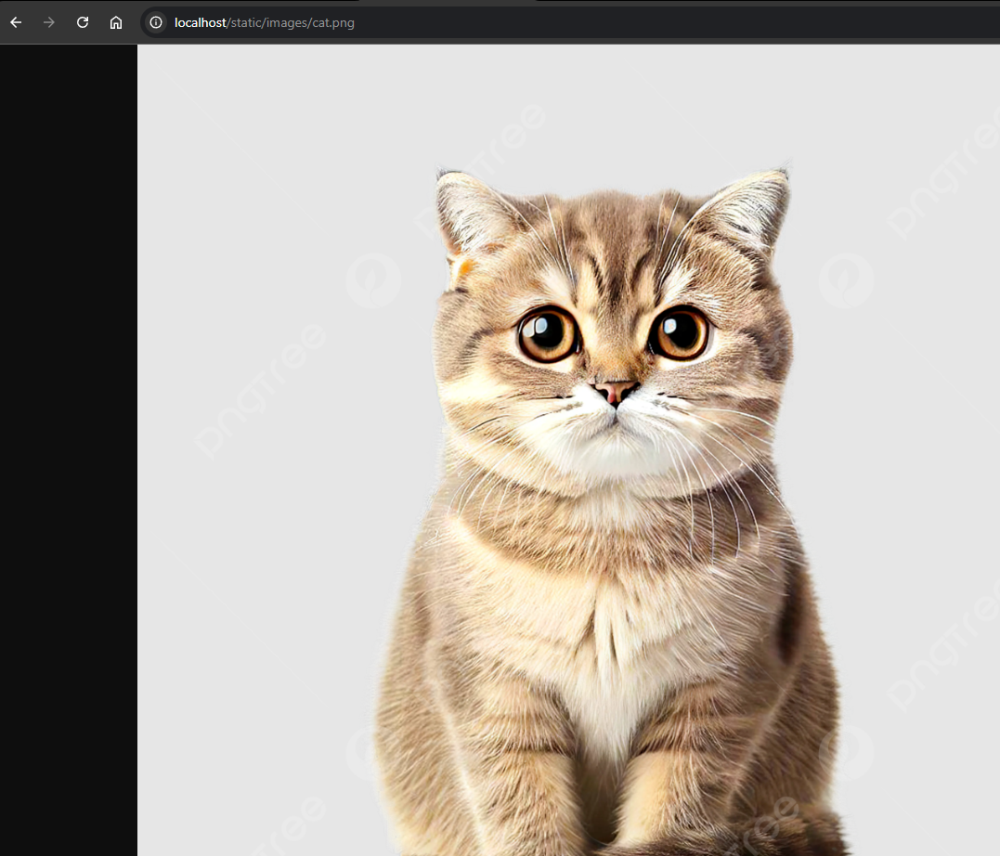
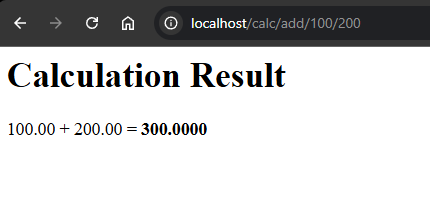
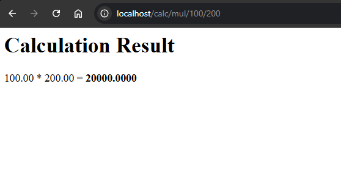
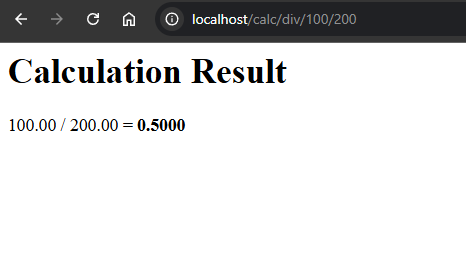
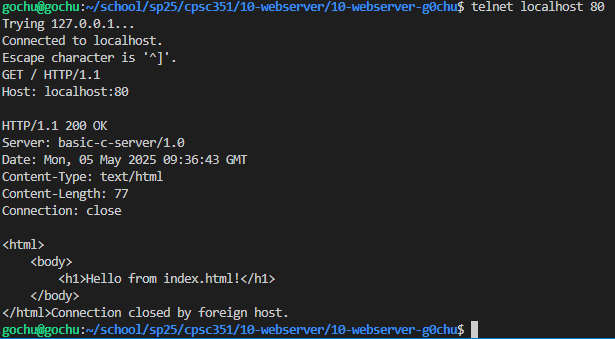
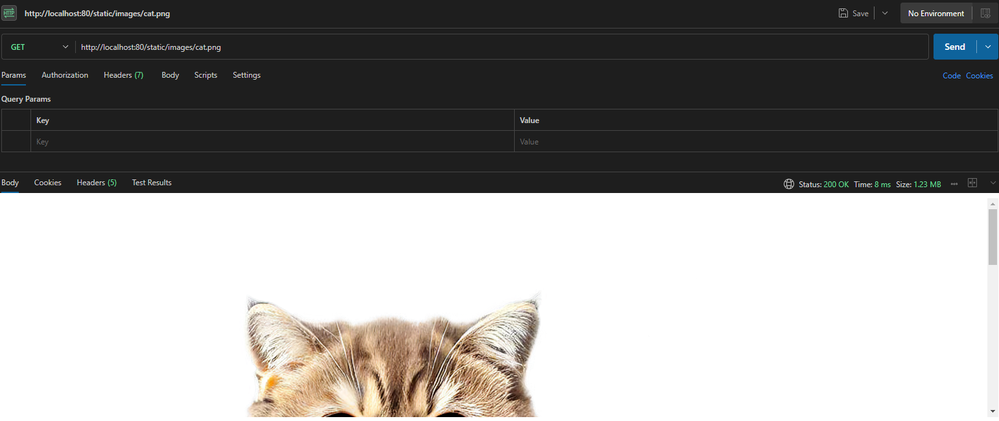

# 10-webserver

## Build & Run

Program should ideally run on POSIX system

1.  **Build:**
    ```bash
    make
    ```
2.  **Run (Default Port 80):**
    ```bash
    sudo ./http_server
    ```
3.  **Run (Custom Port):**
    ```bash
    ./http_server -p 8080
    ```

## Endpoints

*   `GET /`: Serves `./static/index.html`.
*   `GET /static/<path>`: Serves file from `./static/<path>`.
*   `GET /calc/{add|mul|div}/<num1>/<num2>`: Performs calculation, returns HTML.

## Browser Testing

### localhost



### localhost/static/test.txt



### localhost/static/images/cat.png



### localhost/calc







## telnet Test



## Postman Test

